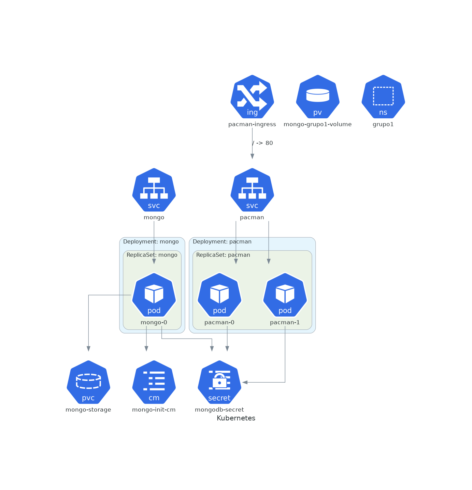
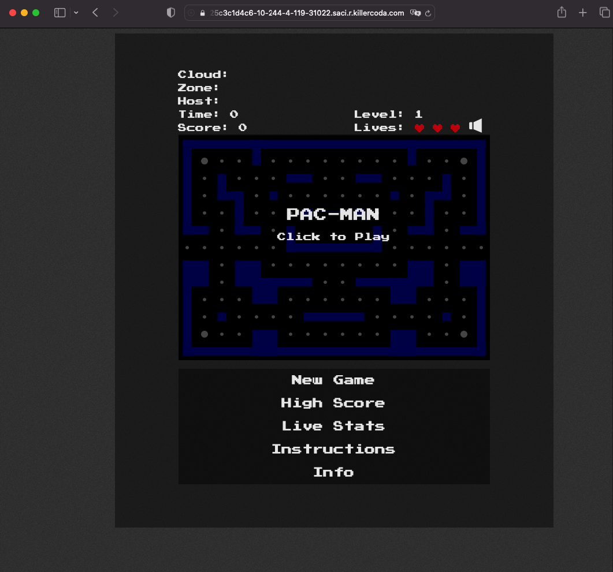
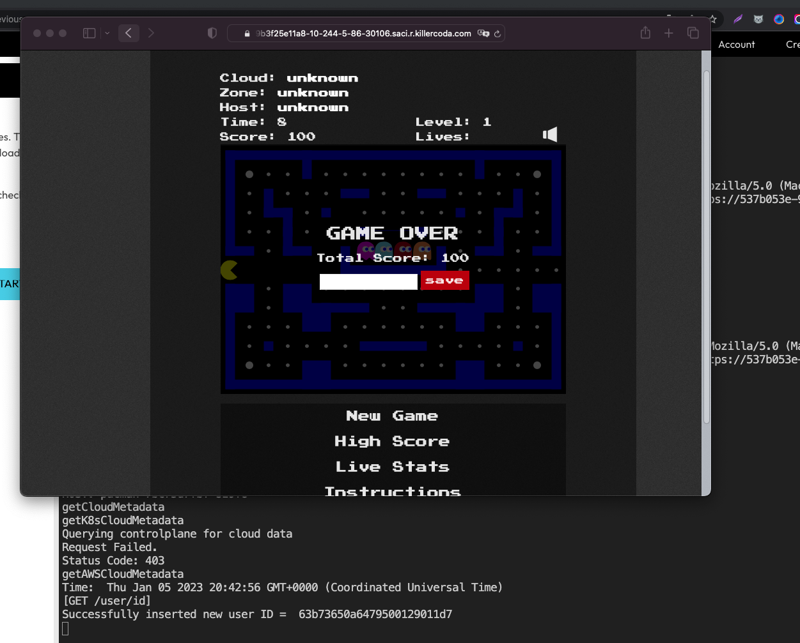
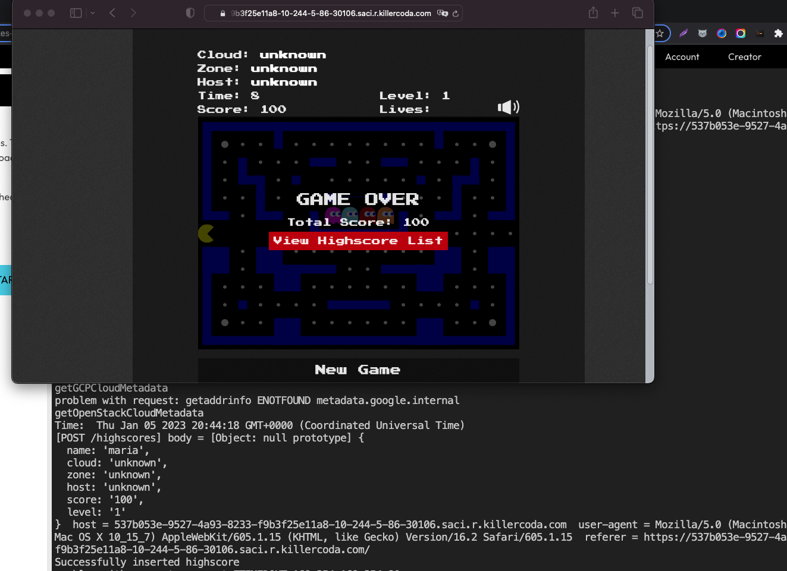
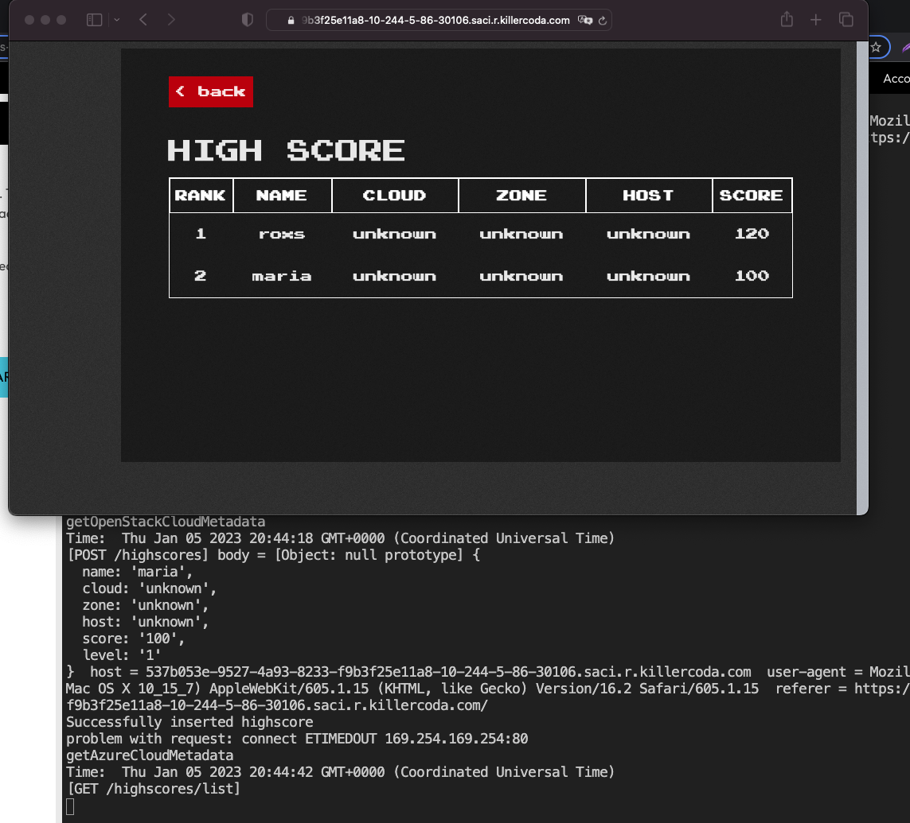
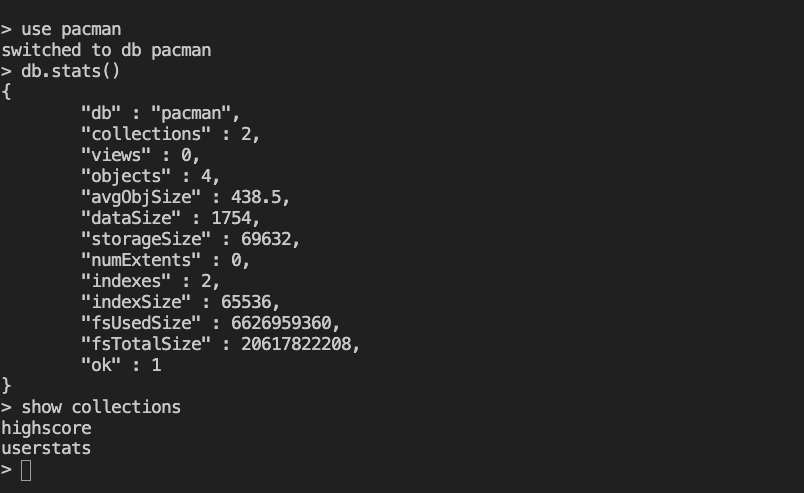

# Kubernetes Practica Final

Usted es elegido como DevOps Principal en una organización cuyo principal foco es migrar parte de sus soluciones a un entorno más _cloud-native_.

En esta tarea vamos a desplegar una aplicación que requiere de dos servicios para su ejecución. La aplicación se llama pacman y necesita los siguientes servicios:

- La aplicación Pacman es una aplicación web y es servida en el puerto 8080/tcp. Utilizaremos la imagen roxsross12/pacman:1.0.0 , Esta aplicación guarda la información en una base de datos no relacional mongo, que utiliza el puerto 27017/tcp para recibir las conexiones. Usaremos la imagen mongo:4.0.3.

- Recuerden apuntar siempre a las buenas practicas

La Diagrama de la solución se muestra a continuación con todos los objetos de k8s:

### Arquitecturas




> Nos piden entonces modelar la aplicación para poder ejecutarla dentro de Kubernetes.

### Consideraciones:

- Utilizar por ahora los objetos vistos en la unidad teórica
- Ubicar la aplicación en un _namespace_ particular, sabiendo que eventualmente surgirán muchas otras aplicaciones
- Cumplir con los atributos de calidad que esperamos para una aplicación de esta índole: alta disponibilidad, elasticidad, tolerancia a fallos.

### Especificaciones de Infraestructura:
- Mientras realizan el challenge pueden usar minikube ó killercoda 
- Tomar las siguientes consideraciones si trabajan de forma temporal con minikube ó killercoda 
  - Crear una pv: especifica el el hostpath el grupoX que corresponden y ademas etiqueta app:grupoX
```
apiVersion: v1
kind: PersistentVolume
metadata:
  name: mongo-grupo1-volume
  labels:
    app: grupo1
spec:
  storageClassName: local-storage   
  capacity:
    storage: 5Gi
  accessModes:
    - ReadWriteMany
  hostPath:
    path: "/mnt/grupo1/"
  ```
> recuerda en el pvc agregar el mismo storageClassName: local-storage que la pv y el labels que corrsponda

- En la Evaluacion se conectaran en un cluster AWS EKS para realizar el despliegue de la aplicación.

- En la Evaluación estará creado los PersistentVolume (PV) y separado por los grupoX:

Pueden validar: `kubectl get pv`

```
kind: PersistentVolume
apiVersion: v1
metadata:
  name: mongo-grupo1-volume
  labels:
    app: grupo1
spec:
  storageClassName: local-storage   
  capacity:
    storage: 5Gi
  accessModes:
    - ReadWriteMany
  hostPath:
    path: "/mnt/grupo1/"
---
kind: PersistentVolume
apiVersion: v1
metadata:
  name: mongo-grupo2-volume
  labels:
    app: grupo2
spec:
  storageClassName: local-storage   
  capacity:
    storage: 5Gi
  accessModes:
    - ReadWriteMany
  hostPath:
    path: "/mnt/grupo2/"
---
kind: PersistentVolume
apiVersion: v1
metadata:
  name: mongo-grupo3-volume
  labels:
    app: grupo3
spec:
  storageClassName: local-storage   
  capacity:
    storage: 5Gi
  accessModes:
    - ReadWriteMany
  hostPath:
    path: "/mnt/grupo3/"
```

### Especificaciones Tecnicas:

- _namespace_ : Nombre del grupo

Ejemplo:

```
kubectl create ns grupo1
```
- o pueden crear un fichero del ns
```
apiVersion: v1
kind: Namespace
metadata:
  name: grupo1
```

### Aplicación Pacman

- 1
```
Create a deployment: name = 'pacman-deployment'
image = 'roxsross12/pacman:1.0.1'
containerPort: 8080
replicas: 2
        env:
        - name: MONGO_SERVICE_HOST
          value: mongo
        - name: MONGO_AUTH_USER
          value: app_user
        - name: MONGO_AUTH_PWD
          value: app_pass
        - name: MONGODB_DATABASE
          value: pacman
        - name: MY_MONGO_PORT
          value: "27017"
        - name: MONGO_USE_SSL
          value: "false"
        - name: MONGO_VALIDATE_SSL
          value: "false"
        - name: MY_NODE_NAME
          valueFrom:
            fieldRef:
              apiVersion: v1
              fieldPath: spec.nodeName        
```
- 2 
```
Create a new service: name = pacman-service
port = '80'
targetPort = '8080'
type: NodePort
```
- 3 - Solo para desplega en la evaluacion recuerden especificar en el path el grupoX que corresponda
```
apiVersion: networking.k8s.io/v1
kind: Ingress
metadata:
  name: pacman-ingress
  annotations:
    nginx.ingress.kubernetes.io/rewrite-target: /
spec:
  ingressClassName: nginx
  rules:
    - http:
        paths:
        - path: /grupo1
          pathType: Prefix
          backend:
            service:
              name: pacman-service
              port:
                number: 80
```

### Resultados
```
controlplane $ k get pod,deploy,svc
NAME                                    READY   STATUS    RESTARTS   AGE
pod/pacman-deployment-58d9756957-64mb   1/1     Running   0          15m
pod/pacman-deployment-b4774f546-dj9gc   1/1     Running   0          67s

NAME                                READY   UP-TO-DATE   AVAILABLE   AGE
deployment.apps/pacman-deployment   2/2     2            2           67s

NAME                     TYPE        CLUSTER-IP       EXTERNAL-IP   PORT(S)        AGE
service/kubernetes       ClusterIP   10.96.0.1        <none>        443/TCP        13d
service/pacman-service   NodePort    10.105.251.229   <none>        80:30095/TCP   67s
```
### LOGS
```
controlplane $ k logs pod/pacman-deployment-b4774f546-dj9gc
Thu Jan  5 03:14:31 UTC 2023

> pacman@0.0.1 start /usr/src/app
> node .

Listening on port 8080
Connected to database server successfully
controlplane $ 
```

### Base de Datos Mongo

- 1 PV - solo aplica para killercoda, en la evaluacion estaran creados por 3 PV con grupox
```
PersistentVolume - Name: mongo-grupo1-volume
Labels: app:grupo1
storageClassName: local-storage   
Access modes: ReadWriteMany
Size: 2Gi
hostPath: "/mnt/grupo1/"
```
- 2 PVC
```
PersistentVolumeClaim - Name: mongo-storage
Access modes: ReadWriteMany
storageClassName: local-storage   
Labels: app:grupo1

Size: 1Gi
```
- 3 SECRET "Recuerden convertir en base64"
```
Secret - Name: mongodb-secret
type: Opaque 
data:
  MONGO_INITDB_ROOT_USERNAME: root
  MONGO_INITDB_ROOT_PASSWORD: secret
  MONGODB_USER: app_user
  MONGODB_PASSWORD: app_pass
stringData:
  MONGODB_DATABASE: "pacman"
```

- 4 Configmap
```
ConfigMap - Name: mongo-init-cm
data:
  mongo-init.sh: |
    echo "Creating curator user..."
    echo '
        use '${MONGODB_DATABASE}'
        db.createUser(
            {
                user: "'${MONGODB_USER}'",
                pwd: "'${MONGODB_PASSWORD}'",
                roles: [ "readWrite" ]
            }
        )
        exit' | mongo
```
- 5 
```
Create a deployment: name = 'mongo'
image = 'mongo:4.0.3'
containerPort: 27017
args: ["--auth"]
        env:
        - name: MONGODB_ADMIN_PASSWORD
          value: clyde
        - name: MONGO_INITDB_ROOT_USERNAME
          value: root
        - name: MONGO_INITDB_ROOT_PASSWORD
          value: secret
        - name: MONGODB_DATABASE
          value: pacman   
        - name: MONGODB_PASSWORD
          value: app_pass
        - name: MONGODB_USER
          value: app_user
        volumeMounts:
          - name: mongo-db
            mountPath: /data/db
          - name : init-script
            mountPath: /docker-entrypoint-initdb.d
            readOnly: true
      volumes:
        - name: mongo-db
          persistentVolumeClaim:
            claimName: mongo-storage
        - name: init-script
          configMap:
             name: mongo-init-cm
             items:
              - key: mongo-init.sh
                path: mongo-init.sh     
```

6 -
```
Create a new service: name = mongo
port = '27017'
targetPort = '27017'
type: ClusterIP
```

### Resultado Despliegue
```
controlplane $ k get pod,deploy,svc,pvc,pv,secret,cm
NAME                         READY   STATUS    RESTARTS   AGE
pod/mongo-58d9756957-64mbs   1/1     Running   0          3m36s

NAME                    READY   UP-TO-DATE   AVAILABLE   AGE
deployment.apps/mongo   1/1     1            1           3m36s

NAME                 TYPE        CLUSTER-IP      EXTERNAL-IP   PORT(S)     AGE
service/kubernetes   ClusterIP   10.96.0.1       <none>        443/TCP     13d
service/mongo        ClusterIP   10.98.118.121   <none>        27017/TCP   3m36s

NAME                                  STATUS   VOLUME         CAPACITY   ACCESS MODES   STORAGECLASS   AGE
persistentvolumeclaim/mongo-storage   Bound    mongo-volume   5Gi        RWX                           3m36s

NAME                                  CAPACITY   ACCESS MODES   RECLAIM POLICY   STATUS   CLAIM                   STORAGECLASS   REASON   AGE
persistentvolume/mongo-grupo1-volume   5Gi        RWX            Retain           Bound    default/mongo-storage                           3m36s

NAME                          TYPE     DATA   AGE
secret/mongodb-secret         Opaque   5      3m36s

NAME                                    DATA   AGE
configmap/kube-root-ca.crt              1      13d
configmap/mongo-init-cm                 1      3m36s

```
### verificar estado de la base de datos

```
controlplane $ kubectl exec -it mongo-58d9756957-64mbs -- bash
root@mongo-58d9756957-64mbs:/# printenv |grep MONGO   
MONGO_VERSION=4.0.3
MONGO_PORT=tcp://10.98.118.121:27017
MONGO_PORT_27017_TCP=tcp://10.98.118.121:27017
MONGO_SERVICE_HOST=10.98.118.121
MONGO_PACKAGE=mongodb-org
MONGODB_ADMIN_PASSWORD=clyde
MONGO_REPO=repo.mongodb.org
MONGO_INITDB_ROOT_PASSWORD=secret
MONGODB_DATABASE=pacman
MONGODB_PASSWORD=app_pass
MONGO_PORT_27017_TCP_PROTO=tcp
MONGO_PORT_27017_TCP_ADDR=10.98.118.121
MONGO_MAJOR=4.0
MONGODB_USER=app_user
MONGO_INITDB_ROOT_USERNAME=root
MONGO_PORT_27017_TCP_PORT=27017
MONGO_SERVICE_PORT=27017
root@mongo-58d9756957-64mbs:/# mongo pacman -u root -p secret --authenticationDatabase admin 
MongoDB shell version v4.0.3
connecting to: mongodb://127.0.0.1:27017/pacman
Implicit session: session { "id" : UUID("194cdd5e-4ccb-4352-968e-ea07cb908e2e") }
MongoDB server version: 4.0.3
Welcome to the MongoDB shell.

> use pacman
switched to db pacman
> show users
{
        "_id" : "pacman.app_user",
        "user" : "app_user",
        "db" : "pacman",
        "roles" : [
                {
                        "role" : "readWrite",
                        "db" : "pacman"
                }
        ],
        "mechanisms" : [
                "SCRAM-SHA-1",
                "SCRAM-SHA-256"
        ]
}
> 
```

### Resumen de objetos

- Aplicacion Pacman
        - Deployment
        - Service
        - Ingress
- Base de Datos Mongo
        - ConfigMap
        - Secret
        - PersistentVolume
        - PersistentVolumeClaim
        - Deployment
        - Service


### Resultados 
- Vista al Usuario final


- Si el usuario pierde debe guardar su nombre para el score


> recomiendo estar atentos a los logs de la app para ver si realmente esta insertando los datos

- Se Inserta en la BD por metodo POST


- Historico de usuarios y score



- Revisen la BD Mongo si realmente creo las colecciones 




Muchos Exitos TEAM

¡queremos entender tu forma de pensar! 

> Busca los logros donde no hay límites by @roxsross


## Entrega y Devolución

Con respecto a la entrega, de ahora en más el formato de entrega será subir los manifiestos YAML en su versión final en el repositorio de cada estudiante. 
